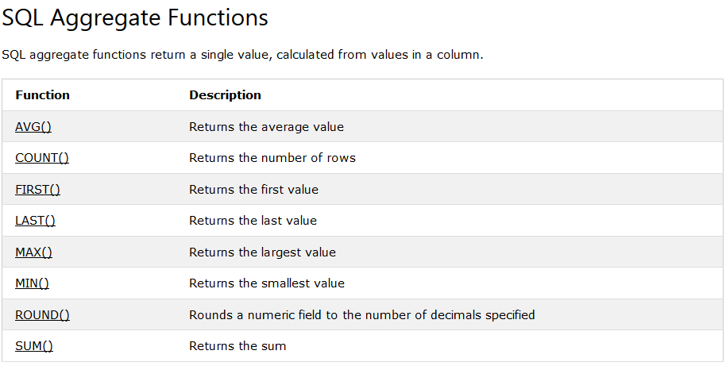
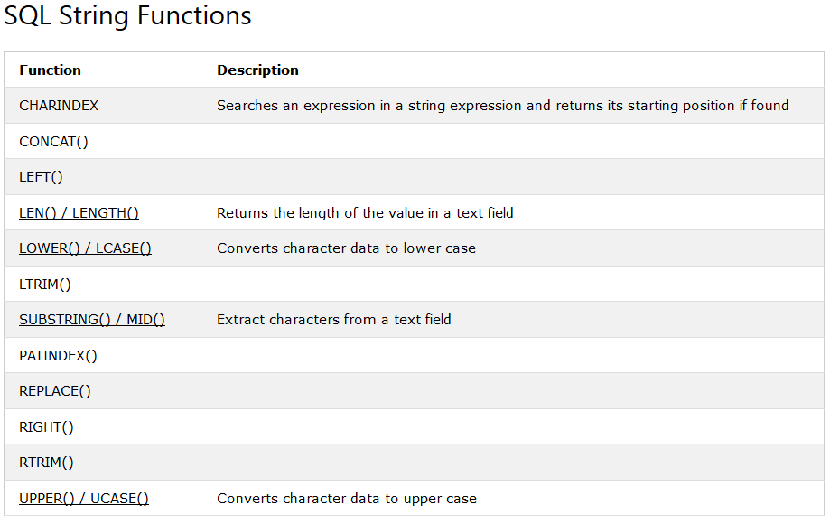
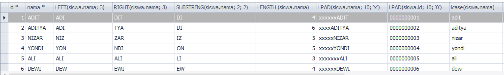
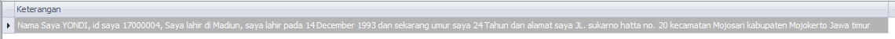

# SQL Fungsi
***

##### (Rabu, 12-04-2017) Materi
## A. Pembahasan materi SQL Fungsi
### a) SQL Fungsi Agregasi
 

### b) SQL Fungsi String

***

##### (Kamis, 13-04-2017) PR Case
## B. Membuat SQL Join tabel dengan SQL Fungsi String (Berdasarkan case)
#### a) Desaigner Database
* Database = db_magang_2.1
 

#### b) PR Case : Membuat SQL Join tabel dengan SQL Fungsi String berdasarkan case
	
* Contoh case :

		SELECT siswa.id, siswa.nama, LEFT(siswa.nama, 3) , RIGHT(siswa.nama, 3) , 
		SUBSTRING(siswa.nama, 2, 2) ,LENGTH (siswa.nama) , LPAD(siswa.nama, 10, 'x') , 
		LPAD(siswa.id, 10, '0') , lcase(siswa.nama) , ucase(siswa.nama), 
		CONCAT('Nama Saya ', siswa.nama , ', saya lahir di ', tempat_lahir) , 
		DATEDIFF('2014-11-30','2014-11-29') 
		FROM siswa			

* Output
 

* Tugas : Outputnya dalam 1 kolom yang bernama Keterangan

		nama kolom as Keterangan
		"Nama saya YONDI , id saya 17000001, Saya lahir di Nganjuk , 
		saya lahir pada 26 October 1995 dan 
		sekarang umur saya 29 Tahun dan alamat saya JL. Diponegoro no 26 
		kecamatan Wilangan kabupaten Nganjuk Jawa Timur "

#### c) Jawaban PR Case :

* Menampilkan seluruh data
		
		SELECT CONCAT('Nama Saya ', UCASE(siswa.nama), ', id saya ', SUBSTRING(NOW(), 3, 2), LPAD(siswa.id, 6, '0'), ', Saya lahir di ', UCASE(SUBSTRING(siswa.tempat_lahir, 1,1)), LCASE(SUBSTRING(siswa.tempat_lahir, 2)), ', saya lahir pada ', DATE_FORMAT(siswa.tanggal_lahir, '%d %M %Y'), ' dan sekarang umur saya ', 
		(YEAR(NOW()) - YEAR(tanggal_lahir)) , ' Tahun dan alamat saya ' ,UCASE(SUBSTRING(siswa.alamat, 1,4)),LCASE(SUBSTRING(siswa.alamat, 5)) , ' kecamatan ', 
		UCASE(SUBSTRING(kecamatan.nama, 1,1)), LCASE(SUBSTRING(kecamatan.nama, 2)) , ' kabupaten ', UCASE(SUBSTRING(kabupaten.nama, 1,1)),
		LCASE(SUBSTRING(kabupaten.nama, 2)), ' ', UCASE(SUBSTRING(provinsi.nama, 1,1)), LCASE(SUBSTRING(provinsi.nama, 2)) ) AS Keterangan 
		FROM siswa, kecamatan, kabupaten, provinsi 
		WHERE siswa.id_kecamatan = kecamatan.id 
		AND kecamatan.id_kabupaten = kabupaten.id 
		AND kabupaten.id_provinsi = provinsi.id

* Hanya menampilkan data Yondi sesuai Tugas
		
		SELECT CONCAT('Nama Saya ', UCASE(siswa.nama), ', id saya ', SUBSTRING(NOW(), 3, 2), LPAD(siswa.id, 6, '0'), ', Saya lahir di ', UCASE(SUBSTRING(siswa.tempat_lahir, 1,1)), LCASE(SUBSTRING(siswa.tempat_lahir, 2)), ', saya lahir pada ', DATE_FORMAT(siswa.tanggal_lahir, '%d %M %Y'), ' dan sekarang umur saya ', 
		(YEAR(NOW()) - YEAR(tanggal_lahir)) , ' Tahun dan alamat saya ' ,UCASE(SUBSTRING(siswa.alamat, 1,4)), LCASE(SUBSTRING(siswa.alamat, 5)) , ' kecamatan ', 
		UCASE(SUBSTRING(kecamatan.nama, 1,1)), LCASE(SUBSTRING(kecamatan.nama, 2)) , ' kabupaten ', UCASE(SUBSTRING(kabupaten.nama, 1,1)), LCASE(SUBSTRING(kabupaten.nama, 2)), ' ', UCASE(SUBSTRING(provinsi.nama, 1,1)), LCASE(SUBSTRING(provinsi.nama, 2)) ) AS Keterangan 
		FROM siswa, kecamatan, kabupaten, provinsi 
		WHERE siswa.id_kecamatan = kecamatan.id 
		AND kecamatan.id_kabupaten = kabupaten.id 
		AND kabupaten.id_provinsi = provinsi.id
		AND siswa.nama = 'YONDI'

* Output :
