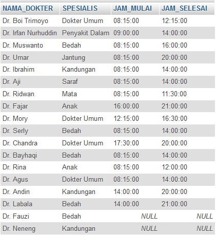
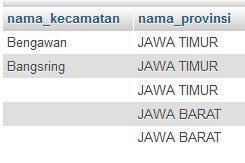
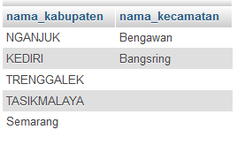

# SQL Inner Join
***

##### (Selasa, 11-04-2017) Case 1
## A. Menerapkan macam-macam SQL Join Tabel
#### a) Desaigner Database
* Database = ukk_11102016_sbd_153140914111007_hildakhairunnisa
 

#### b) Case 1 : Membuat database dan menerapkan macam-macam SQL Join Tabel 
## >> SQL Join Tabel
1. Menampilkan seluruh data pada tabel dokter dan tabel spesialis (Dalam 2 tabel)

		SELECT * 
		FROM tb_dokter, tb_spesialis 
		WHERE tb_spesialis.KD_SPESIALIS = tb_dokter.KD_SPESIALIS;

	* Output                         
 

2. Menampilkan seluruh data pada tabel dokter dan tabel jaga (Dalam 2 tabel)

		SELECT * 
		FROM tb_dokter, tb_jaga
		WHERE tb_dokter.KD_DOKTER = tb_jaga.KD_DOKTER;

	* Output                         
 

3. Menampilkan nama dokter dan spesialis (Dalam 2 tabel)

		SELECT tb_dokter.NAMA_DOKTER, tb_spesialis.SPESIALIS
		FROM tb_dokter, tb_spesialis
		WHERE tb_dokter.KD_SPESIALIS=tb_spesialis.KD_SPESIALIS;

	* Output                         
 

4. Menampilkan nama dokter, jam mulai dan jam selesai (Dalam 2 tabel)

		SELECT tb_dokter.NAMA_DOKTER, tb_jaga.JAM_MULAI, tb_jaga.JAM_SELESAI
		FROM tb_dokter, tb_jaga
		WHERE tb_dokter.KD_DOKTER=tb_jaga.KD_DOKTER;

	* Output                         
 

5. Menampilkan nama dokter, spesialis, jam mulai, jam selesai (Dalam 3 tabel) 

		SELECT tb_dokter.NAMA_DOKTER, tb_spesialis.SPESIALIS, tb_jaga.JAM_MULAI, tb_jaga.JAM_SELESAI
		FROM tb_dokter, tb_spesialis, tb_jaga
		WHERE tb_dokter.KD_SPESIALIS=tb_spesialis.KD_SPESIALIS
		AND tb_dokter.KD_DOKTER=tb_jaga.KD_DOKTER;

	* Output                         
 

## >> SQL Inner Join
1. Menampilkan seluruh data pada tabel dokter dan tabel spesialis (Dalam 2 tabel)

		SELECT * 	
		FROM tb_dokter INNER JOIN tb_spesialis 
		ON tb_spesialis.KD_SPESIALIS = tb_dokter.KD_SPESIALIS;

	* Output                         
 

2. Menampilkan seluruh data pada tabel dokter dan tabel jaga (Dalam 2 tabel)

		SELECT * 
		FROM tb_dokter INNER JOIN tb_jaga
		ON tb_dokter.KD_DOKTER = tb_jaga.KD_DOKTER;

	* Output                         
 

3. Menampilkan nama dokter dan spesialis (Dalam 2 tabel)

		SELECT tb_dokter.NAMA_DOKTER, tb_spesialis.SPESIALIS
		FROM tb_dokter INNER JOIN tb_spesialis
		ON tb_dokter.KD_SPESIALIS=tb_spesialis.KD_SPESIALIS;

	* Output                         
 

4. Menampilkan nama dokter, jam mulai dan jam selesai (Dalam 2 tabel)

		SELECT tb_dokter.NAMA_DOKTER, tb_jaga.JAM_MULAI, tb_jaga.JAM_SELESAI
		FROM tb_dokter INNER JOIn tb_jaga
		ON tb_dokter.KD_DOKTER=tb_jaga.KD_DOKTER;

	* Output                         
 

5. Menampilkan nama dokter, spesialis, jam mulai, jam selesai (Dalam 3 tabel) 

		SELECT tb_dokter.NAMA_DOKTER, tb_spesialis.SPESIALIS, tb_jaga.JAM_MULAI, tb_jaga.JAM_SELESAI
		FROM ((tb_dokter INNER JOIN tb_spesialis ON tb_dokter.KD_SPESIALIS = tb_spesialis.KD_SPESIALIS)
		INNER JOIN tb_jaga ON tb_dokter.KD_DOKTER = tb_jaga.KD_DOKTER);

	* Output                         
 

## >> SQL Left Join
1. Menampilkan nama dokter, spesialis  (Dalam 2 tabel menurut tabel ke 1)

		SELECT tb_dokter.NAMA_DOKTER, tb_spesialis.SPESIALIS
		FROM tb_dokter LEFT JOIN tb_spesialis 
		ON tb_dokter.KD_SPESIALIS = tb_spesialis.KD_SPESIALIS;

	* Output                         
  

2. Menampilkan nama dokter, jam mulai dan jam selesai (Dalam 2 tabel menurut tabel ke 1)

		SELECT tb_dokter.NAMA_DOKTER, tb_jaga.JAM_MULAI, tb_jaga.JAM_SELESAI
		FROM tb_dokter LEFT JOIN tb_jaga
		ON tb_dokter.KD_DOKTER=tb_jaga.KD_DOKTER;

	* Output                         
  

3. Menampilkan nama dokter, spesialis, jam mulai, jam selesai (Dalam 3 tabel menurut tabel ke 1) 

		SELECT tb_dokter.NAMA_DOKTER, tb_spesialis.SPESIALIS, tb_jaga.JAM_MULAI, tb_jaga.JAM_SELESAI
		FROM ((tb_dokter LEFT JOIN tb_spesialis ON tb_dokter.KD_SPESIALIS = tb_spesialis.KD_SPESIALIS)
		LEFT JOIN tb_jaga ON tb_dokter.KD_DOKTER = tb_jaga.KD_DOKTER);

	* Output                         
 

## >> SQL Right Join
1. Menampilkan nama dokter, spesialis  (Dalam 2 tabel menurut tabel ke 2)

		SELECT tb_dokter.NAMA_DOKTER, tb_spesialis.SPESIALIS
		FROM tb_dokter RIGHT JOIN tb_spesialis 
		ON tb_dokter.KD_SPESIALIS = tb_spesialis.KD_SPESIALIS;

	* Output                         
  

2. Menampilkan nama dokter, jam mulai dan jam selesai (Dalam 2 tabel menurut tabel ke 2)

		SELECT tb_dokter.NAMA_DOKTER, tb_jaga.JAM_MULAI, tb_jaga.JAM_SELESAI
		FROM tb_dokter RIGHT JOIN tb_jaga
		ON tb_dokter.KD_DOKTER=tb_jaga.KD_DOKTER;

	* Output                         
  

3. Menampilkan nama dokter, spesialis, jam mulai, jam selesai (Dalam 3 tabel menurut tabel ke 2) 

		SELECT tb_dokter.NAMA_DOKTER, tb_spesialis.SPESIALIS, tb_jaga.JAM_MULAI, tb_jaga.JAM_SELESAI
		FROM ((tb_dokter RIGHT JOIN tb_spesialis ON tb_dokter.KD_SPESIALIS = tb_spesialis.KD_SPESIALIS)
		RIGHT JOIN tb_jaga ON tb_dokter.KD_DOKTER = tb_jaga.KD_DOKTER);

	* Output                         
 

## >> SQL Left Join dengan Order By
1. Menampilkan nama dokter, spesialis  (Dalam 2 tabel), Menurut urutan tabel 1 dengan nama dokter ascending (A-Z)

		SELECT tb_dokter.NAMA_DOKTER, tb_spesialis.SPESIALIS
		FROM tb_dokter LEFT JOIN tb_spesialis 
		ON tb_dokter.KD_SPESIALIS = tb_spesialis.KD_SPESIALIS
		ORDER BY tb_dokter.NAMA_DOKTER;

	* Output                         
  

2. Menampilkan nama dokter, spesialis  (Dalam 2 tabel), Menurut urutan tabel 1 dengan nama dokter descending (Z-A)

		SELECT tb_dokter.NAMA_DOKTER, tb_spesialis.SPESIALIS
		FROM tb_dokter LEFT JOIN tb_spesialis 
		ON tb_dokter.KD_SPESIALIS = tb_spesialis.KD_SPESIALIS
		ORDER BY tb_dokter.NAMA_DOKTER DESC;

	* Output                         
  

## >> SQL Right Join dengan Order By
1. Menampilkan nama dokter, spesialis  (Dalam 2 tabel menurut tabel ke 2), Menurut urutan tabel 2 dengan nama dokter ascending (A-Z)

		SELECT tb_dokter.NAMA_DOKTER, tb_spesialis.SPESIALIS
		FROM tb_dokter RIGHT JOIN tb_spesialis 
		ON tb_dokter.KD_SPESIALIS = tb_spesialis.KD_SPESIALIS
		ORDER BY tb_dokter.NAMA_DOKTER;

	* Output                         
  

2. Menampilkan nama dokter, spesialis  (Dalam 2 tabel menurut tabel ke 2), Menurut urutan tabel 2 dengan nama dokter descending (Z-A)

		SELECT tb_dokter.NAMA_DOKTER, tb_spesialis.SPESIALIS
		FROM tb_dokter RIGHT JOIN tb_spesialis 
		ON tb_dokter.KD_SPESIALIS = tb_spesialis.KD_SPESIALIS
		ORDER BY tb_dokter.NAMA_DOKTER DESC;

	* Output                         
  

3. Menampilkan nama dokter, spesialis  (Dalam 2 tabel menurut tabel ke 2), Menurut urutan tabel 2 dengan spesialis ascending (A-Z)

		SELECT tb_dokter.NAMA_DOKTER, tb_spesialis.SPESIALIS
		FROM tb_dokter RIGHT JOIN tb_spesialis 
		ON tb_dokter.KD_SPESIALIS = tb_spesialis.KD_SPESIALIS
		ORDER BY tb_spesialis.SPESIALIS;

	* Output                         
  

4. Menampilkan nama dokter, spesialis  (Dalam 2 tabel menurut tabel ke 2), Menurut urutan tabel 2 dengan spesialis descending (Z-A)

		SELECT tb_dokter.NAMA_DOKTER, tb_spesialis.SPESIALIS
		FROM tb_dokter RIGHT JOIN tb_spesialis 
		ON tb_dokter.KD_SPESIALIS = tb_spesialis.KD_SPESIALIS
		ORDER BY tb_spesialis.SPESIALIS DESC;

	* Output                         
  

### SQL Left Join dengan Is Null
- Menampilkan nama dokter, jam mulai dan jam selesai, Menurut urutan tabel 1 dengan menampilkan data tabel 2  yang tidak terisi

		SELECT tb_dokter.NAMA_DOKTER, tb_jaga.JAM_MULAI, tb_jaga.JAM_SELESAI
		FROM tb_dokter LEFT JOIN tb_jaga
		ON tb_dokter.KD_DOKTER=tb_jaga.KD_DOKTER
		WHERE tb_jaga.KD_DOKTER IS NULL;

	* Output                         
  

### SQL Right Join dengan Is Null
- Menampilkan nama dokter, spesialis  (Dalam 2 tabel menurut tabel ke 2), Menurut urutan tabel 2 dengan menampilkan data tabel 1  yang tidak terisi

		SELECT tb_dokter.NAMA_DOKTER, tb_spesialis.SPESIALIS
		FROM tb_dokter RIGHT JOIN tb_spesialis 
		ON tb_dokter.KD_SPESIALIS = tb_spesialis.KD_SPESIALIS
		WHERE tb_dokter.KD_SPESIALIS IS NULL;

	* Output                         
  
***

##### (Selasa, 11-04-2017) Case 2
## B. Membuat SQL Join Tabel konsep Inner Join (Berdasarkan case)
#### a) Desaigner Database
* Database = db_magang_1
 

#### b) Case 2 : Membuat SQL Join Tabel konsep Inner Join berdasarkan case
1. Tampilkan data nama kecamatan dan nama kabupaten

		SELECT kecamatan.nama_kecamatan,kabupaten.nama_kabupaten
		FROM kecamatan,kabupaten
		WHERE kecamatan.id_kabupaten=kabupaten.id_kabupaten

		atau

		SELECT x.nama_kecamatan,y.nama_kabupaten
		FROM kecamatan x,kabupaten y
		WHERE x.id_kabupaten=y.id_kabupaten

		atau

		SELECT kecamatan.nama_kecamatan,kabupaten.nama_kabupaten
		FROM kecamatan INNER JOIN kabupaten
		ON (kecamatan.id_kabupaten=kabupaten.id_kabupaten)

	* Output                         
 

2. Tampilkan data nama kecamatan beserta nama kabupaten dan nama provinsinya

		SELECT kecamatan.nama_kecamatan,kabupaten.nama_kabupaten, provinsi.nama_provinsi
		FROM kecamatan, kabupaten, provinsi
		WHERE kecamatan.id_kabupaten=kabupaten.id_kabupaten AND kabupaten.id_provinsi=provinsi.id_provinsi

	* Output                         
 

3. Tampilkan seluruh data nama kecamatan dan nama provinsinya

		SELECT kecamatan.nama_kecamatan, provinsi.nama_provinsi
		FROM kecamatan, kabupaten, provinsi
		WHERE kecamatan.id_kabupaten=kabupaten.id_kabupaten AND kabupaten.id_provinsi=provinsi.id_provinsi

	* Output                         
 

4. Tampilkan seluruh data nama kabupaten dan nama kecamatannya (seluruh kabupaten muncul baik yg tidak punya kecamatan atau yg punya kecamatan)

		SELECT kabupaten.nama_kabupaten , kecamatan.nama_kecamatan
		FROM kabupaten left join kecamatan 
		ON kabupaten.id_kabupaten = kecamatan.id_kabupaten

	* Output                         
 
***

##### (Selasa, 11-04-2017) Pembahasan
## C. Pembahasan materi SQL Join Tabel konsep Inner Join dan contoh case
#### a) Desaigner Database
* Database = db_magang_1
 

#### b) Contoh penambahan tabel negara :
		
		Tabel negara
		- id
		- nama

		Tabel provinsi
		- id_provinsi
		- id_negara
		- nama_provinsi

		Tabel kabupaten
		- id_kabupaten
		- id_provinsi
		- nama_kabupaten
		- jumlah_penduduk

		Tabel kecamatan
		- id_kecamatan
		- id_kabupaten
		- nama_kecamatan

#### c) Langkah – langkah :

		SELECT (nama field / nama kolom yang akan ditampilkan)
		FROM (tabel sesuai field / kolom yang akan ditampilkan)
		WHERE (kondisi dimana tabelA.Key=tabelB.Key)
		AND (penambahan kondisi)

#### d) Contoh Case :
1. Tampilkan data nama kecamatan beserta nama kabupaten ,nama provinsinya , nama negara

		SELECT kecamatan.nama_kecamatan , kabupaten.nama_kabupaten , provinsi.nama_provinsi , negara.nama
		FROM kecamatan , kabupaten , provinsi , negara
		WHERE kecamatan.id_kabupaten = kabupaten.id_kabupaten 
		AND kabupaten.id_provinsi = provinsi.id_provinsi 
		AND negara.id = provinsi.id_negara

2. Tampilkan data nama kecamatan dan nama kabupaten

		SELECT kecamatan.nama_kecamatan,kabupaten.nama_kabupaten
		FROM kecamatan,kabupaten
		WHERE kecamatan.id_kabupaten=kabupaten.id_kabupaten

		Atau
		SELECT x.nama_kecamatan,y.nama_kabupaten
		FROM kecamatan x,kabupaten y
		WHERE x.id_kabupaten=y.id_kabupaten

		Atau
		SELECT kecamatan.nama_kecamatan,kabupaten.nama_kabupaten
		FROM kecamatan INNER JOIN kabupaten
		ON (kecamatan.id_kabupaten=kabupaten.id_kabupaten)

	* Output                         
 

