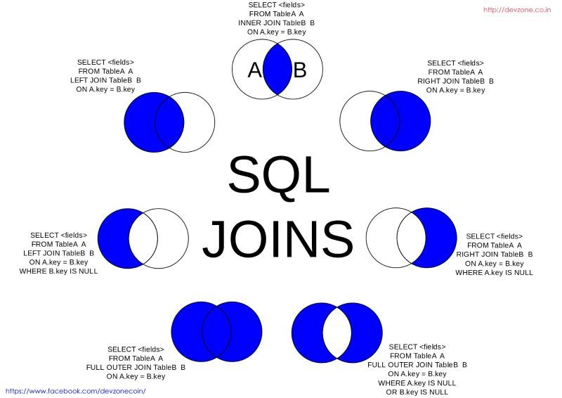
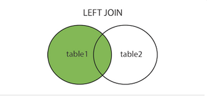
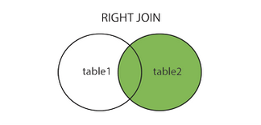

# SQL Join
***

***
##### (Selasa, 11-04-2017)
# Materi SQL Join
***

## A. Penjelasan SQL
SQL adalah kependekan dari Structured Query Language, merupakan sebuah bahasa 
yang digunakan untuk mengakses data dalam basis data (database) relasional. SQL banyak 
diterapkan pada pemrograman berbasis client-server seperti PHP, ASP, Java J2EE, dan 
sebagainya. Contoh software SQL yang terkenal adalah MySQL, MsSQL (Microsoft), Oracle 
SQL, Postgre SQL (open source). Masing-masing software mempunyai keunggulan sendiri-
sendiri, sejauh yang saya tahu Oracle SQL handal dalam hal keamanan dan ukuran database 
yang bisa mencapai tera byte, sedang MsSQL lebih banyak bermain di Memory untuk 
processing. Dari ketiga software ini, Oracle SQl bisa dikatakan sebagai pemegang pertama. 
Perintah dasar SQL pada dasarnya hampir sama baik MySQL, Postgre SQL, MsSQL atau 
Oracle SQL.
***

## B. Penjelasan MySQL
MySQL adalah multiuser database yang menggunakan bahasa Structured Query Language (SQL). 
MySQL dalam operasi client-server melibatkan server daemon MySQL disisi 
server dam berbagai program library yang berjalan disisi client. 
Dan SQL adalah bahasa standart yang digunakan untuk mengakses database server.
***

## C. Macam-macam SQL Join 
1. Inner Join
2. Outer Join
3. Full Outer Join

## >> 1. SQL Inner Join 

Inner join merupakan jenis join yang paling umum yang dapat digunakan pada semua database. Jenis ini dapat digunakan bila ingin merelasikan dua set data yang ada di tabel, letak relasinya setelah pada perintah ON pada join. Bentuk kondisi join dimana di antara 2 atau lebih tabel yang ingin di join memiliki hubungan sehingga semua isi tabel yang di pilih bisa di tampilkan

* Bentuk secara umum SQL Inner Join

		SELECT column_name(s)
		FROM table1
		INNER JOIN table2 ON table1.column_name = table2.column_name;

## >> 2. SQL Outer Join 
 
--------------------------------------------------------------------------------
Outer join merupakan jenis join yang sedikit berbeda dengan inner join. Pada 
MySQL, bentuk perintah untuk menerapkan outer join ada 2 yaitu :

*	Left Join = Sebuah query dengan LEFT JOIN akan menampilkan semua baris dari tabel sebelah kiri (pertama/utama atau pasien) dengan gabungan dari tabel sebelah kanan (kedua atau symptom).

* Bentuk secara umum SQL Left Join

		SELECT column_name(s)
		FROM table1
		LEFT JOIN table2 ON table1.column_name = table2.column_name;

*	Right Join = Query RIGHT JOIN hampir sama dengan LEFT JOIN, hanya saja posisinya terbalik, yaitu akan menampilkan semua baris dari tabel kanan (kedua) meskipun tidak ada kecocokan pada tabel kiri (pertama).

* Bentuk secara umum SQL Right Join

		SELECT column_name(s)
		FROM table1
		RIGHT JOIN table2 ON table1.column_name = table2.column_name;

## >> 3. SQL FULL Outer Join
 
Full join akan menampilkan semua isi tabel sisi kiri walaupun data di pasangan joinnya yang disisi kanan nilainya null atau sebaliknya

* Bentuk secara umum SQL FULL Outer Join

		SELECT column_name(s)
		FROM table1
		FULL OUTER JOIN table2 ON table1.column_name = table2.column_name;
***

