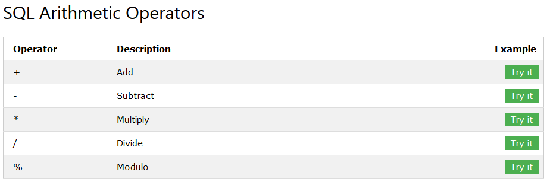
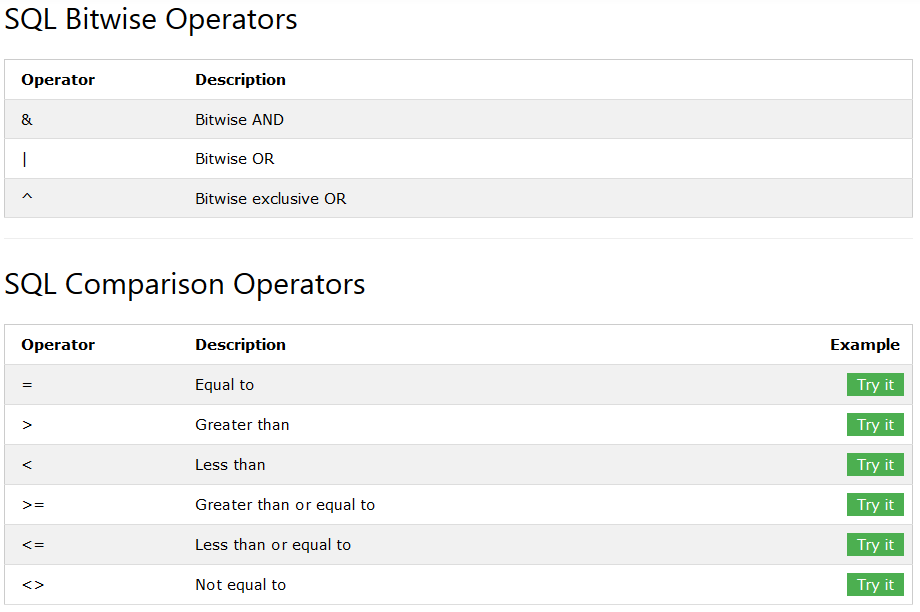
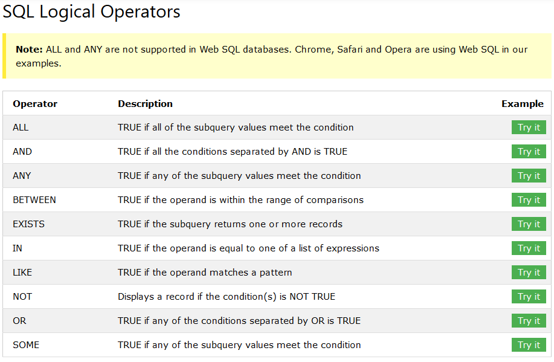
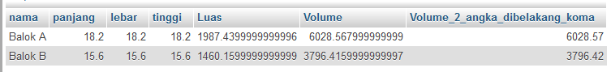

# SQL Operator
***

##### (Rabu, 12-04-2017) Materi
## A. Materi SQL Operator
### a) SQL Operator Aritmatika
 

### b) SQL Operator Pembanding 
 

### c) SQL Operator Logikal
 
***

##### (Rabu, 12-04-2017) Case 2
## B. Membuat contoh SQL Operator Pembanding (Berdasarkan case)
#### a) Desaigner Database
* Database = db_magang_2
 

#### b) Case 2 : Membuat contoh SQL Operator Pembanding berdasarkan case
		
		Operator Pembanding : 
		1. =
		2. <>
		3. >
		4. <
		5. >=
		6. <=
		7. like '%a'
		8. like 'b%'
		9. like '%b%'
		10. in('a','b')
		11. not in('a','b')

1. Operator =
	
		SELECT *
		FROM siswa
		WHERE nama = 'YONDI'

		SELECT *
		FROM siswa
		WHERE nama = 'ADIT' or tempat_lahir = 'MALANG'

		SELECT *
		FROM siswa
		WHERE (nama = 'YONDI' or nama = 'ADIT' or nama = 'ALI' or nama = 'NIZAR')

2. Operator <>

		SELECT *
		FROM siswa
		WHERE id <> 10

3. Operator >

		SELECT *
		FROM siswa
		WHERE siswa.tanggal_lahir > '1992-10-20'

		SELECT *
		FROM siswa
		WHERE siswa.tanggal_lahir > '1992’

4. Operator <

		SELECT *
		FROM siswa
		WHERE siswa.tanggal_lahir < '1992-10-20'

		SELECT *
		FROM siswa
		WHERE siswa.tanggal_lahir < '1992’

		select *
		from siswa
		where nama = 'ADIT' and tanggal_lahir < '1995-01-01'

5. Operator >=

		SELECT *
		FROM siswa
		WHERE siswa.tanggal_lahir >= '1992-10-20'

		SELECT *
		FROM siswa
		WHERE siswa.tanggal_lahir >= '1992’

6. Operator <=
		
		SELECT *
		FROM siswa
		WHERE siswa.tanggal_lahir <= '1992-10-20'

		SELECT *
		FROM siswa
		WHERE siswa.tanggal_lahir <= '1992’

7. Operator like 'a%'

		SELECT *
		FROM siswa
		WHERE nama like 'a%' 

8. Operator like '%a'
		
		SELECT *
		FROM siswa
		WHERE nama like '%a' 

9. Operator like '%ag%'
		
		SELECT *
		FROM siswa
		WHERE nama like '%ag%' 

10. Operator in('a','b')
		
		SELECT *
		FROM siswa
		WHERE nama IN('YONDI','ADIT')

11. Operator not in('a','b')
		
		SELECT *
		FROM siswa
		WHERE nama NOT IN('YONDI','ADIT','ALI','NIZAR')
***

##### (Rabu, 12-04-2017) Case 3
## C. Membuat SQL Operator Aritmatika (Berdasarkan Case)
#### a) Desaigner Database
* Database = db_magang_2.1
 

#### b) Case 3 : Membuat SQL Operator Aritmatika berdasarkan case
	
		Soal :
		Tampilan Output Semua data (nama,panjang,lebar,luas,volume,volume_2_angka_dibelakang_koma)

		Keterangan Database :
		create table object_balok(
		nama varchar(20)
		panjang decimal(18,2)
		lebar decimal(18,2)
		tinggi decimal(18,2)
		)

#### c) Tampilan output Semua data (nama,panjang,lebar,luas,volume,volume_2_angka_dibelakang_koma)

		SELECT nama, panjang, lebar, tinggi, 2*((panjang*lebar)+(panjang*tinggi)+(lebar*tinggi)) AS 'Luas',panjang*lebar*tinggi AS 'Volume',
		ROUND(panjang*lebar*tinggi,2) AS 'Volume_2_angka_dibelakang_koma'
		FROM object_balok

	* Output                         
 
***

##### (Kamis, 13-04-2017) Pembahasan
## D. Pembahasan materi SQL Join Tabel dengan SQL Operator Pembanding dan contoh case
#### a) Desaigner Database
* Database = db_magang_2.1
 

#### b) Contoh Case :

		Operator Pembanding : 
		1. =
		2. <>
		3. >
		4. <
		5. >=
		6. <=
		7. like '%a'
		8. like 'b%'
		9. like '%b%'
		10. in('a','b')
		11. not in('a','b')

1. Operator =
		
		SELECT *
		FROM siswa
		WHERE nama = 'YONDI'

		SELECT *
		FROM siswa
		WHERE (nama = 'YONDI' or nama = 'ADIT' or nama = 'ALI' or nama = 'NIZAR')

		SELECT *
		FROM siswa
		WHERE nama = 'ADIT' or tempat_lahir = 'MALANG'

		SELECT *
		FROM siswa
		WHERE nama = 'ADIT' and tempat_lahir = 'MALANG'

2. Operator <>
		
		SELECT *
		FROM siswa
		WHERE id <> 10

3. Operator <
		
		SELECT *
		FROM siswa
		WHERE siswa.tanggal_lahir < '1992-10-20'

4. Operator >
		
		SELECT *
		FROM siswa
		WHERE siswa.tanggal_lahir > '1992-10-20'

		SELECT *
		FROM siswa
		WHERE siswa.tanggal_lahir > '1992’

5. Operator >=
		
		SELECT *
		FROM siswa
		WHERE siswa.tanggal_lahir >= '1992-10-20'

6. Operator <=

		SELECT *
		FROM siswa
		WHERE siswa.tanggal_lahir <= '1992-10-20'

7) like '%a'

		SELECT *
		FROM siswa
		WHERE nama like '%a'

8) like 'b%'

		SELECT *
		FROM siswa
		WHERE nama like 'a%'

		SELECT *
		FROM siswa
		WHERE nama like 'a%' and nama like 'ab%'

9) like '%b%'

		SELECT *
		FROM siswa
		WHERE nama like '%a%'

10) in ('a','b')

		SELECT *
		FROM siswa
		WHERE nama in('YONDI','ADIT')

11) not in ('a','b')

		SELECT *
		FROM siswa
		WHERE nama not in('YONDI','ADIT','ALI','NIZAR')
***

##### (Kamis, 13-04-2017) Case 1
## E. Membuat contoh SQL Join tabel konsep Inner Join dengan SQL Operator Pembanding
#### a) Desaigner Database
* Database = db_magang_2.1
 

#### b) Case 1 : Membuat contoh SQL Join Tabel konsep Inner Join dengan SQL Operator Pembanding

		Operator Pembanding : 
		1. =
		2. <>
		3. >
		4. <
		5. >=
		6. <=
		7. like '%a'
		8. like 'b%'
		9. like '%b%'
		10. in('a','b')
		11. not in('a','b')

1. Operator =
		
	* Menampilkan data sesuai nama kabupaten BLITAR
		
			SELECT *
			FROM kabupaten
			WHERE nama = 'BLITAR'

	* Menampilkan data sesuai id kabupaten 4
			
			SELECT *
			FROM kabupaten
			WHERE id = 4

	* Menampilkan data nama siswa dan nama kabupaten (ADIT, KEDIRI)

			SELECT siswa.nama, kabupaten.nama
			FROM siswa INNER JOIN kabupaten
			ON siswa.nama = 'ADIT'AND kabupaten.nama = 'KEDIRI'

			SELECT *
			FROM siswa
			WHERE (nama = 'YONDI' or nama = 'ADIT' or nama = 'ALI' or nama = 'NIZAR')

	* Menampilkan data nisn siswa, nama siswa, nama mata pelajaran, nilai angka dari siswa untuk nama (YONDI, ADIT, ALI, NIZAR) dengan pengurutan nama (Z-A) descending 

			SELECT siswa.nisn, siswa.nama, mata_pelajaran.nama, nilai_mata_pelajaran.nilai_angka
			FROM siswa, mata_pelajaran, nilai_mata_pelajaran
			WHERE siswa.id = nilai_mata_pelajaran.id_siswa 
			and mata_pelajaran.id = nilai_mata_pelajaran.id_mata_pelajaran 
			and siswa.nama = 'YONDI' or siswa.nama = 'ADIT' or siswa.nama = 'ALI' or siswa.nama = 'NIZAR'
			ORDER BY siswa.nama DESC

	* Menampilkan data nisn siswa, nama siswa, nama mata pelajaran, nilai angka kecuali nilai angka dari nilai mata pelajaran untuk nilai angka (75) dengan nama mata pelajaran yang di tampilkan adalah BAHASA INDONESIA 

			SELECT siswa.nisn, siswa.nama, mata_pelajaran.nama, nilai_mata_pelajaran.nilai_angka
			FROM siswa, mata_pelajaran, nilai_mata_pelajaran
			WHERE siswa.id = nilai_mata_pelajaran.id_siswa 
			and mata_pelajaran.id = nilai_mata_pelajaran.id_mata_pelajaran 
			and nilai_mata_pelajaran.nilai_angka <> 75
			and mata_pelajaran.nama = 'BAHASA INDONESIA'

2. Operator <>

	* Menampilkan data nama kabupaten kecuali nama kabupaten BLITAR

			SELECT *
			FROM kabupaten
			WHERE nama <> 'BLITAR'

	* Menampilkan data id kabupaten kecuali id kabupaten 4

			SELECT *
			FROM kabupaten
			WHERE id <> 4

	* Menampilkan data nisn siswa, nama siswa, nama mata pelajaran, nilai angka kecuali nilai angka dari nilai mata pelajaran untuk nilai angka (75) 

			SELECT siswa.nisn, siswa.nama, mata_pelajaran.nama, nilai_mata_pelajaran.nilai_angka
			FROM siswa, mata_pelajaran, nilai_mata_pelajaran
			WHERE siswa.id = nilai_mata_pelajaran.id_siswa 
			and mata_pelajaran.id = nilai_mata_pelajaran.id_mata_pelajaran 
			and nilai_mata_pelajaran.nilai_angka <> (75)

3. Operator >

	* Menampilkan data nisn siswa, nama siswa, nama mata pelajaran, nilai angka lebih dari nilai mata pelajaran untuk nilai angka (75) 

			SELECT siswa.nisn, siswa.nama, mata_pelajaran.nama, nilai_mata_pelajaran.nilai_angka
			FROM siswa, mata_pelajaran, nilai_mata_pelajaran
			WHERE siswa.id = nilai_mata_pelajaran.id_siswa 
			and mata_pelajaran.id = nilai_mata_pelajaran.id_mata_pelajaran 
			and nilai_mata_pelajaran.nilai_angka > (75)

4. Operator <

	* Menampilkan data nisn siswa, nama siswa, nama mata pelajaran, nilai angka kurang dari nilai mata pelajaran untuk nilai angka (75) 

			SELECT siswa.nisn, siswa.nama, mata_pelajaran.nama, nilai_mata_pelajaran.nilai_angka
			FROM siswa, mata_pelajaran, nilai_mata_pelajaran
			WHERE siswa.id = nilai_mata_pelajaran.id_siswa 
			and mata_pelajaran.id = nilai_mata_pelajaran.id_mata_pelajaran 
			and nilai_mata_pelajaran.nilai_angka < (75)

5. Operator >=

	* Menampilkan data nisn siswa, nama siswa, nama mata pelajaran, nilai angka lebih dari samadengan nilai mata pelajaran untuk nilai angka (75) 

			SELECT siswa.nisn, siswa.nama, mata_pelajaran.nama, nilai_mata_pelajaran.nilai_angka
			FROM siswa, mata_pelajaran, nilai_mata_pelajaran
			WHERE siswa.id = nilai_mata_pelajaran.id_siswa 
			and mata_pelajaran.id = nilai_mata_pelajaran.id_mata_pelajaran 
			and nilai_mata_pelajaran.nilai_angka >= (75)

6. Operator <=

	* Menampilkan data nisn siswa, nama siswa, nama mata pelajaran, nilai angka kurang dari samadengan nilai mata pelajaran untuk nilai angka (75) 

			SELECT siswa.nisn, siswa.nama, mata_pelajaran.nama, nilai_mata_pelajaran.nilai_angka
			FROM siswa, mata_pelajaran, nilai_mata_pelajaran
			WHERE siswa.id = nilai_mata_pelajaran.id_siswa 
			and mata_pelajaran.id = nilai_mata_pelajaran.id_mata_pelajaran 
			and nilai_mata_pelajaran.nilai_angka <= (75)

7. Operator Like '%I'

	* Menampilkan data nama siswa, nama agama, nama provinsi, nama kabupaten dan tanggal lahir dari siswa untuk nama huruf belakangnya"AD" 

			SELECT siswa.nama, agama.nama, provinsi.nama, kabupaten.nama, siswa.tanggal_lahir 
			FROM siswa, agama, provinsi, kabupaten , kecamatan
			WHERE siswa.id_agama = agama.id 
			and siswa.id_kecamatan = kecamatan.id 
			and kecamatan.id_kabupaten = kabupaten.id 
			and kabupaten.id_provinsi = provinsi.id 
			and siswa.nama LIKE '%I'

	* Menampilkan data nama siswa, nama agama, nama provinsi, nama kabupaten dan tanggal lahir dari siswa untuk nama huruf belakangnya"AD" dengan pengurutan nama (Z-A) descending 
			
			SELECT siswa.nama, agama.nama, provinsi.nama, kabupaten.nama, siswa.tanggal_lahir 
			FROM siswa, agama, provinsi, kabupaten , kecamatan
			WHERE siswa.id_agama = agama.id 
			and siswa.id_kecamatan = kecamatan.id 
			and kecamatan.id_kabupaten = kabupaten.id 
			and kabupaten.id_provinsi = provinsi.id 
			and siswa.nama LIKE '%I'
			ORDER BY siswa.nama DESC

8. Operator Like 'AD%'
	
	* Menampilkan data nama siswa, nama agama, nama provinsi, nama kabupaten dan tanggal lahir dari siswa untuk nama huruf depannya "AD" 

			SELECT siswa.nama, agama.nama, provinsi.nama, kabupaten.nama, siswa.tanggal_lahir 
			FROM siswa, agama, provinsi, kabupaten , kecamatan
			WHERE siswa.id_agama = agama.id 
			and siswa.id_kecamatan = kecamatan.id 
			and kecamatan.id_kabupaten = kabupaten.id 
			and kabupaten.id_provinsi = provinsi.id 
			and siswa.nama LIKE 'AD%'

9. Operator Like '%DI%'

	* Menampilkan data nama siswa, nama agama, nama provinsi, nama kabupaten dan tanggal lahir dari siswa untuk nama yang ada huruf "DI" 

			SELECT siswa.nama, agama.nama, provinsi.nama, kabupaten.nama, siswa.tanggal_lahir 
			FROM siswa, agama, provinsi, kabupaten , kecamatan
			WHERE siswa.id_agama = agama.id 
			and siswa.id_kecamatan = kecamatan.id 
			and kecamatan.id_kabupaten = kabupaten.id 
			and kabupaten.id_provinsi = provinsi.id 
			and siswa.nama LIKE '%DI%'

10. Operator in ()

	* Menampilkan data nisn siswa, nama siswa, nama mata pelajaran, nilai angka dari nilai mata pelajaran untuk nilai angka (90,75) 
			
			SELECT siswa.nisn, siswa.nama, mata_pelajaran.nama, nilai_mata_pelajaran.nilai_angka
			FROM siswa, mata_pelajaran, nilai_mata_pelajaran
			WHERE siswa.id = nilai_mata_pelajaran.id_siswa 
			and mata_pelajaran.id = nilai_mata_pelajaran.id_mata_pelajaran 
			and nilai_mata_pelajaran.nilai_angka IN (90,75)

11. Operator not in ()

	* Tidak menampilkan data nama siswa, nama agama, nama provinsi, nama kabupaten dan tanggal lahir dari siswa untuk nama (ADIT, ADITYA, ALI, ARIF) 

			SELECT siswa.nama, agama.nama, provinsi.nama, kabupaten.nama, siswa.tanggal_lahir 
			FROM siswa, agama, provinsi, kabupaten , kecamatan
			WHERE siswa.id_agama = agama.id 
			and siswa.id_kecamatan = kecamatan.id 
			and kecamatan.id_kabupaten = kabupaten.id 
			and kabupaten.id_provinsi = provinsi.id 
			and siswa.nama NOT IN ('ADIT', 'ADITYA', 'ALI', 'ARIF')
***

##### (Kamis, 13-04-2017) Pembahasan
## F. Pembahasan materi SQL Join Tabel konsep Inner Join dengan SQL Operator Pembanding dan contoh case
#### a) Desaigner Database
* Database = db_magang_2.1
 

#### b) Pembahasan materi SQL Join Tabel konsep Inner Join dengan SQL Operator Pembanding

1. Menampilkan nama yg tidak memiliki sertifikat dan memiliki sertifikat

		SELECT siswa.nama , sertifikat_siswa.nama_sertifikat 
		FROM siswa LEFT JOIN sertifikat_siswa 
		ON (sertifikat_siswa.id_siswa = siswa.id) 

2. Menampilkan nama yg tidak memiliki sertifikat dengan NULL

		SELECT siswa.nama , sertifikat_siswa.nama_sertifikat 
		FROM siswa left join sertifikat_siswa ON (sertifikat_siswa.id_siswa = siswa.id) 
		WHERE sertifikat_siswa.nama_sertifikat is NULL 

3. Menampilkan nama yg tidak memiliki sertifikat hanya nama saja

		SELECT siswa.nama
		FROM siswa
		WHERE siswa.id not in(select id_siswa from sertifikat_siswa)

4. Menampilkan nama yg memiliki sertifikat 

		SELECT siswa.nama , sertifikat_siswa.nama_sertifikat 
		FROM siswa LEFT JOIN sertifikat_siswa ON (sertifikat_siswa.id_siswa = siswa.id) 
		WHERE sertifikat_siswa.nama_sertifikat is not NULL 

5. Tidak memiliki sertifikat, dengan Sub query, nilai lebih 80, mata pelajaran Matematika 

		SELECT siswa.nisn as 'nisn_siswa',
		siswa.nama as 'nama_siswa',
		mata_pelajaran.nama as 'nama_matkul',
		nilai_mata_pelajaran.nilai_angka as 'nilai_angka'
		FROM siswa, mata_pelajaran, nilai_mata_pelajaran
		WHERE (siswa.id = nilai_mata_pelajaran.id_siswa 
		and mata_pelajaran.id = nilai_mata_pelajaran.id_mata_pelajaran) 
		and siswa.id not in (select id_siswa FROM sertifikat_siswa) 
		and nilai_mata_pelajaran.nilai_angka > 80 
		and mata_pelajaran.nama = 'MATEMATIKA'
		ORDER BY siswa.nama;

6. Tidak memiliki sertifikat, dengan Sub query, nilai lebih 80, mata pelajaran Matematika, kabupaten Nganjuk 
		
		SELECT siswa.nisn as 'nisn_siswa',
		siswa.nama as 'nama_siswa',
		mata_pelajaran.nama as 'nama_matkul',
		nilai_mata_pelajaran.nilai_angka as 'nilai_angka'
		FROM siswa, mata_pelajaran, nilai_mata_pelajaran
		WHERE (siswa.id = nilai_mata_pelajaran.id_siswa 
		and mata_pelajaran.id = nilai_mata_pelajaran.id_mata_pelajaran) 
		and siswa.id not in (select id_siswa FROM sertifikat_siswa) 
		and nilai_mata_pelajaran.nilai_angka > 80 
		and mata_pelajaran.nama = 'MATEMATIKA'
		and id_kecamatan in(
		       select id from kecamatan where id_kabupaten in(
		             select id from kabupaten where nama = 'NGANJUK'
		       ) 
		)
		ORDER BY siswa.nama;

7. Tidak memiliki sertifikat, tidak dengan Sub query, nilai lebih 80, mata pelajaran Matematika, kabupaten Nganjuk 

		SELECT siswa.nisn as 'nisn_siswa',
		siswa.nama as 'nama_siswa',
		mata_pelajaran.nama as 'nama_matkul',
		nilai_mata_pelajaran.nilai_angka as 'nilai_angka'
		FROM siswa, mata_pelajaran, nilai_mata_pelajaran , kecamatan , kabupaten
		WHERE (siswa.id = nilai_mata_pelajaran.id_siswa 
		and mata_pelajaran.id = nilai_mata_pelajaran.id_mata_pelajaran) 
		and siswa.id not in (select id_siswa FROM sertifikat_siswa) 
		and nilai_mata_pelajaran.nilai_angka > 80 
		and mata_pelajaran.nama = 'MATEMATIKA'
		and siswa.id_kecamatan = kecamatan.id 
		and kabupaten.id = kecamatan.id_kabupaten
		and kabupaten.nama = 'NGANJUK'

8. Tidak memiliki sertifikat, tidak dengan Sub query, lebih dari 50, nama sertifikat terisi Null, diurutkan melalui Nama

		SELECT siswa.nama, siswa.tanggal_lahir, agama.nama, kabupaten.nama, provinsi.nama, mata_pelajaran.nama, 
		nilai_mata_pelajaran.nilai_angka ,sertifikat_siswa.nama_sertifikat
		FROM siswa left join sertifikat_siswa on sertifikat_siswa.id_siswa = siswa.id , agama, kecamatan, kabupaten, provinsi, nilai_mata_pelajaran, mata_pelajaran
		WHERE siswa.id_agama = agama.id 
		and siswa.id_kecamatan = kecamatan.id 
		and kecamatan.id_kabupaten = kabupaten.id 
		and kabupaten.id_provinsi = provinsi.id 
		and nilai_mata_pelajaran.id_siswa = siswa.id 
		and mata_pelajaran.id = nilai_mata_pelajaran.id_mata_pelajaran 
		and nilai_mata_pelajaran.nilai_angka >50 and sertifikat_siswa.id_siswa is NULL
		ORDER BY siswa.nama;

