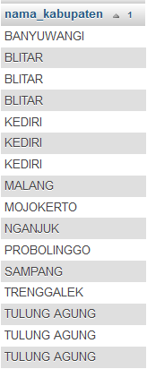
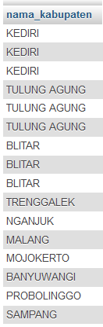
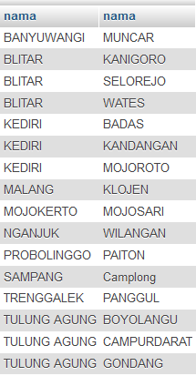
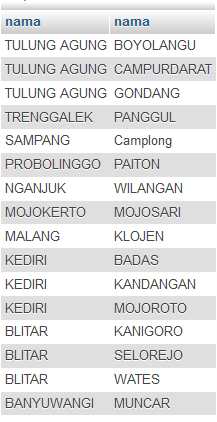
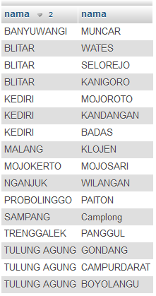

# SQL Order By
***

##### (Rabu, 12-04-2017) Pembahasan
## A. Pembahasan materi SQL Join Tabel dengan Order By, Alias dan contoh case
#### a) Desaigner Database
* Database = db_magang_2
 

#### b) Contoh case :
1. Tampilkan nama kabupaten diurutkan berdasarkan nama kabupaten
	
		SELECT kabupaten.nama as "nama_kabupaten"
		FROM kabupaten , kecamatan
		WHERE kabupaten.id = kecamatan.id_kabupaten
		ORDER BY nama_kabupaten

	* Output                         
 

2. Tampilkan nama kabupaten diurutkan berdasarkan id kabupaten
	
		SELECT kabupaten.nama as "nama_kabupaten"
		FROM kabupaten , kecamatan
		WHERE kabupaten.id = kecamatan.id_kabupaten
		ORDER BY kabupaten.id

	* Output                         
 

3. Tampilkan nama kabupaten, nama kecamatan berdasarkan nama kabupaten dan nama kecamatan 
	
		SELECT kabupaten.nama , kecamatan.nama
		FROM kabupaten , kecamatan
		WHERE kabupaten.id = kecamatan.id_kabupaten
		ORDER BY 1 , 2

		atau

		SELECT kabupaten.nama , kecamatan.nama
		FROM kabupaten , kecamatan
		WHERE kabupaten.id = kecamatan.id_kabupaten
		ORDER BY kabupaten.nama, kecamatan.nama 

	* Output                         
 

4. Tampilkan nama kabupaten, nama kecamatan berdasarkan nama kabupaten dan nama kecamatan, NOTE : nama kabupaten diurutkan (Z-A) dan nama kecamatan diurutkan (A-Z)

		SELECT kabupaten.nama , kecamatan.nama
		FROM kabupaten , kecamatan
		WHERE kabupaten.id = kecamatan.id_kabupaten
		ORDER BY 1 DESC , 2 ASC

		atau

		SELECT kabupaten.nama , kecamatan.nama
		FROM kabupaten , kecamatan
		WHERE kabupaten.id = kecamatan.id_kabupaten
		ORDER BY kabupaten.nama DESC , kecamatan.nama ASC

	* Output                         
 

5. Tampilkan nama kabupaten, nama kecamatan berdasarkan nama kabupaten dan nama kecamatan, NOTE : nama kabupaten diurutkan (A-Z) dan nama kecamatan diurutkan (Z-A)

		SELECT kabupaten.nama , kecamatan.nama
		FROM kabupaten , kecamatan
		WHERE kabupaten.id = kecamatan.id_kabupaten
		ORDER BY 1, 2 DESC

		atau

		SELECT kabupaten.nama , kecamatan.nama
		FROM kabupaten , kecamatan
		WHERE kabupaten.id = kecamatan.id_kabupaten
		ORDER BY kabupaten.nama, kecamatan.nama DESC

	* Output                         
 