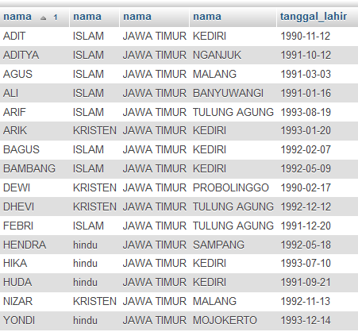
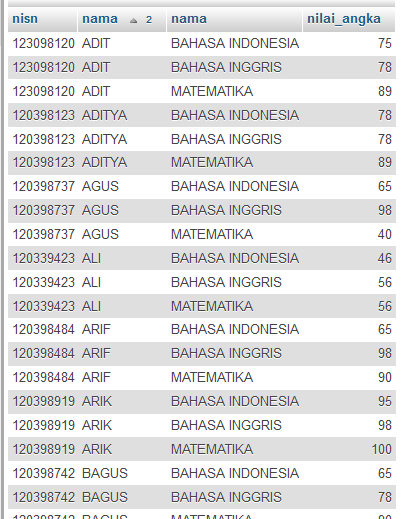
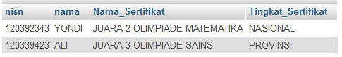
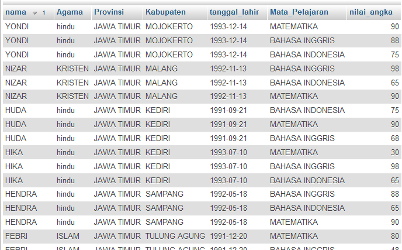

# SQL Order By, Ascending, Descending
***

##### (Rabu, 12-04-2017) Case 1
## A. Membuat SQL Join Tabel konsep Inner Join dengan Order By, Ascending, Descending (Berdasarkan case)
#### a) Desaigner Database
* Database = db_magang_2
 

#### b) Case 1 : Membuat SQL Join Tabel konsep Inner Join dengan Order By, Ascending, Descending berdasarkan case
1. Tampilkan data dengan kolom 
	* nama siswa
	* nama Agama
	* nama Provinsi
	* nama Kota
	* tanggal_lahir
	* Note : Data diurutkan berdasarkan nama siswa (urut dari A-Z)

			SELECT siswa.nama, agama.nama, provinsi.nama, kabupaten.nama, siswa.tanggal_lahir 
			FROM siswa, agama, provinsi, kabupaten , kecamatan
			WHERE siswa.id_agama = agama.id 
			and siswa.id_kecamatan = kecamatan.id 
			and kecamatan.id_kabupaten = kabupaten.id 
			and kabupaten.id_provinsi = provinsi.id order by siswa.nama ASC;

	* Output                         
 

2. Tampilkan data dengan kolom 
	* NISN
	* nama siswa
	* Nama Mata Pelajaran
	* Nilai Angka
	* Note : Data diurutkan berdasarkan nama siswa (urut dari A-Z) dan nama mata pelajaran (urut dari A-Z)

			SELECT siswa.nisn, siswa.nama, mata_pelajaran.nama, nilai_mata_pelajaran.nilai_angka
			FROM siswa, mata_pelajaran, nilai_mata_pelajaran
			WHERE siswa.id = nilai_mata_pelajaran.id_siswa 
			and mata_pelajaran.id = nilai_mata_pelajaran.id_mata_pelajaran 
			order by siswa.nama, mata_pelajaran.nama ASC;

	* Output                         
 

3. Tampilkan data dengan kolom 
	- NISN
	- nama siswa
	- Nama Sertifikat
	- Tingkat Sertifikat

			SELECT siswa.nisn, siswa.nama, sertifikat_siswa.nama_sertifikat AS Nama_Sertifikat, sertifikat_siswa.tingkat AS Tingkat_Sertifikat
			FROM siswa , sertifikat_siswa
			WHERE siswa.id = sertifikat_siswa.id_siswa;

	* Output                         
 

4. Tampilkan data dengan kolom 
	- nama siswa
	- nama Agama
	- nama Provinsi
	- nama Kota
	- tanggal_lahir
	- Nama Mata Pelajaran
	- Nilai Angka
	- Note : data diurutkan berdasarkan nama siswa (urut dari Z-A)

			SELECT siswa.nama , agama.nama AS Agama , provinsi.nama AS Provinsi , kabupaten.nama  AS Kabupaten, siswa.tanggal_lahir , mata_pelajaran.nama AS Mata_Pelajaran, nilai_mata_pelajaran.nilai_angka
			FROM siswa , agama , provinsi , kabupaten , kecamatan , nilai_mata_pelajaran , mata_pelajaran
			WHERE siswa.id_agama = agama.id and siswa.id_kecamatan = kecamatan.id and kecamatan.id_kabupaten = kabupaten.id and kabupaten.id_provinsi = provinsi.id and (siswa.id = nilai_mata_pelajaran.id_siswa) and mata_pelajaran.id = nilai_mata_pelajaran.id_mata_pelajaran order by siswa.nama DESC;

	* Output                         
